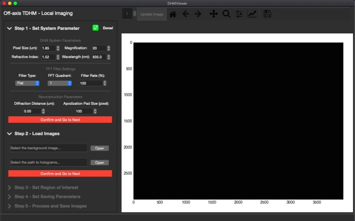
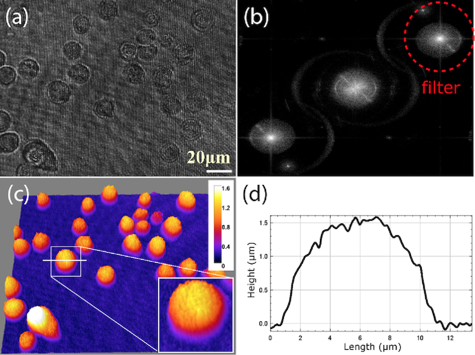
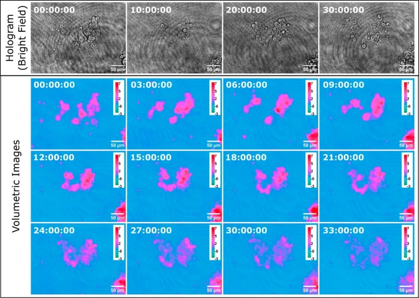
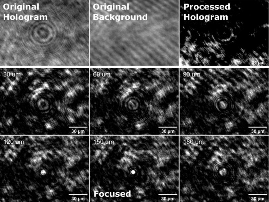

DHM-Viewer
================

DHM-Viewer provide users with a graphical interface for adjusting the DHM parameters as well as viewing, processing, and saving images. The software is based on a series of extensible Standard Operation Procedures (SOPs) developed for the in-line and off-axis modes of P-TDHM.

## Program Screen Shot
| Standard Operation Procedures(SOP) |
|----------------|
||

## Processed Results
| Quantitative Imaging (Off-axis Mode) | Long-term Biological Dynamics (Off-axis Mode) | 3D Particle Tracking (In-line Mode) |
|----------------|----------------|----------------|
||||

## Software Installation and Setup

### System requirements
64-bit Windows 7 or later, macOS 10.14 or later, Ubuntu Linux 18.04 or later, with Python 3.7 or later, a monitor with 1280x800 or higher resolution, and a computer with a USB3 port.

### Package Dependencies
The dependencies include `Matplotlib`, `NumPy`, `Pillow`, `PyQt5`, `Scikit_image`, and `Tifffile`.

### Installation
1. Download and install the latest Python3 (Version 3.7 or above) release. (3.7.13, 3.8.5, and 3.10.12 has been tested).
2. Download and extract the package DHMViewer into the desired directory.
3. Open a terminal in the DHMViewer directory, install the dependencies using pip command. Ran the following command:
```bash
pip install -r./configuration.txt
```

4. Download and Install the Latest Spinnaker Full SDK from [FLIR official website](https://www.flir.ca/support-center/iis/machine-vision/downloads/spinnaker-sdk-and-firmware-download/). We tested `SpinnakerSDK_FULL_3.0.0.118_x64.exe` and `SpinnakerSDK_FULL_2.7.0.128_x64.exe`.

## Intended Workflow
1. Connect the DC power for the laser module and plug the FLIR camera’s USB cable into the computer’s USB3 port.
2. Select the image mode (in-line or off-axis) by sliding the beam blocker to the respective positions.
3. Launch the Spinnaker SpinView software, select camera interface and start capturing.
4. Fine-tune the ND filters to optimize intensity of object and reference beams with the help of the GUI exposure views. The intensity ratio between object and reference beams can be 1 ~ 1.5.
5. Place the samples on the sample holder properly and slide into the microscope body.
6. Captures the background and hologram images with the capture software manufacturer, saving them to two separate
directories.
7. Launch the DHMViewer program, set the desired operation mode and optical parameters.
8. Specify the locations of background and holograms files in the DHMViewer user interface.
9. Optionally specify a Region of Interest (ROI) to be processed.
10. Choose whether to save the processed image, respective file directory, and image types. Select the range of images to be processed.
11. Process (and save) the images, optionally saving the current system configuration.
12. To obtain reconstructed z-stacks for a given off-axis hologram image, repeat steps (7) to (12) and switch between the off-axis
and in-line operation modes.

## Software Operation
Launch the DHMViewer program by double clicking dhm_viewer.py or running the Python command in the terminal.
Ran the following command (Linux, macOS):
```bash
python3 dhm_viewer.py
```
On Windows (py launcher):
```bash
py dhm_viewer.py
```
When the launcher window appears, seen in (Fig. 6a.), click on the desired mode of operation (off-axis or in-line) to switch to the appropriate SOP mode. The main window should appear (Fig. 5.). From the left side panel, click the dropdown menu to expand the details of each step, and click the red proceed button.

1. Optionally load an “.ini” configuration file from the file menu to jump to step 4 ([Menu Options a](#menu-options)). If needed, click the menu items in the menu bar to switch to another DHM mode.
2. Set the parameters matching the desired system configuration and camera sensor specification ([Fig. 8a](#sop-usage)).
3. Specify the file location of the background and the directory locations of the hologram image(s). Enter the address by hand or use
the file browser by clicking the “Load” button. The background and the hologram will be loaded onto the viewer ([SOP Usage b](#sop-usage)).
1. Optionally specify the Region of Interest. Only the content inside ROI will be processed. Click the checkbox “Edit ROI”, then follow the messages above the viewer to select ROI on screen. One can also shuffle the spin-box and click the “Update image”
button at the top of the viewer to view the entire range of images to check the ROI’s relative position ([SOP Usage c](#sop-usage))
1. Check the “save image” checkbox should the processed images need to be saved. In off-axis mode, select the image type to be saved. Select the range of images to be processed by the start and stop points by the spin-boxes. Click the “peek” button to view the selected
start/stop point. Should anything be saved, select a file directory ([SOP Usage d](#sop-usage)).
1. Click the process image button to process the selected images. A progress bar, a “Pause” button, and an “End task” button should
appear on top of the viewer. Click the respective button to pause the operation or to end the processing and go back to save settings. On the side panel, click the dropdown menu to select the viewing image type during processing; clicking the “Live save” button will save the viewer’s currently displayed content ([SOP Usage e](#sop-usage)). In in-line mode, when “Reconstructed volume” is selected as the viewing type, each slice of the reconstructed hologram can be viewed after processing and saving is complete.

Once every dropdown menu has been checked, user is able to click save the configuration to save all current settings into a “.ini” file in the desired directory ([Menu Options c](#menu-options)).

#### Menu Options
![Fig. 7][1]

#### SOP Usage
![Fig. 8][2]

[1]: ../images/gr7.jpg
[2]: ../images/gr8.jpg